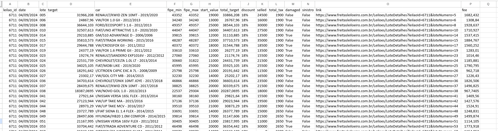

# Extração de Dados do Site Freitas Leilão

O objetivo deste script é extrair dados dos veículos de um leilão em um arquivo CSV, incluindo o valor da tabela FIPE e o percentual desejado para dar lance abaixo da tabela FIPE, considerando taxas e percentual do leiloeiro.

Para rodar o script, basta acessar o site do Freitas Freitas Leiloeiro, acessar um leilão, pegar o ID do lote e configurar no arquivo environment.py.

## Rodar o Script Python
### Pré-requisitos
1. **Instalar Python:** Certifique-se de ter o Python instalado em sua máquina.
1. **Baixar o Projeto do GitHub:** `git clone https://github.com/facarvalho/freitasleiloeiro.git`
1. **environment.py:** arquivo de configuração

### Instalar Dependências
```
pip3 install -r requirements.txt
```

### Executar o Script
```
python3 application.py
```

### Exemplo




[leilao_6711.csv](leilao_6711.csv)
